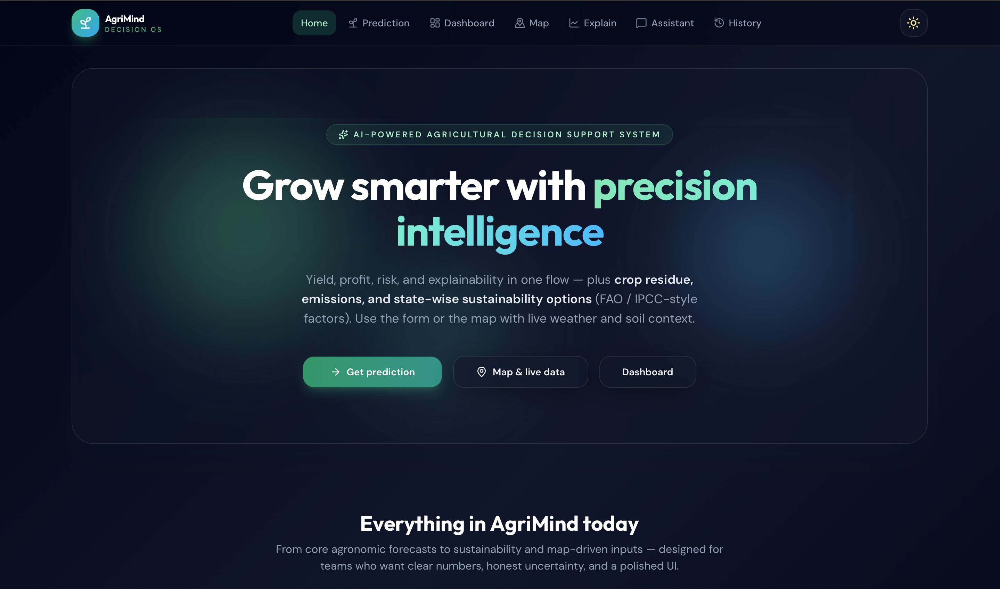
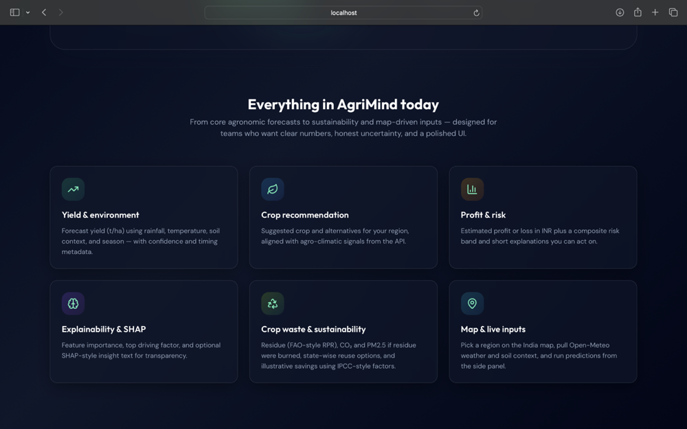
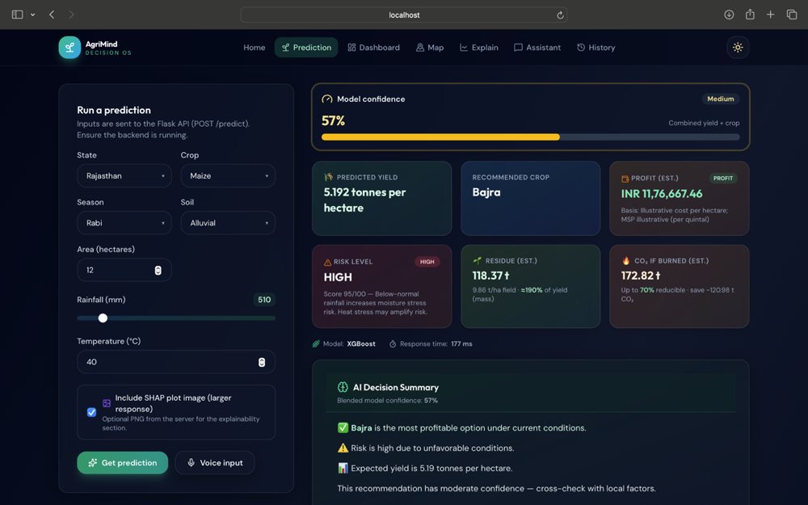
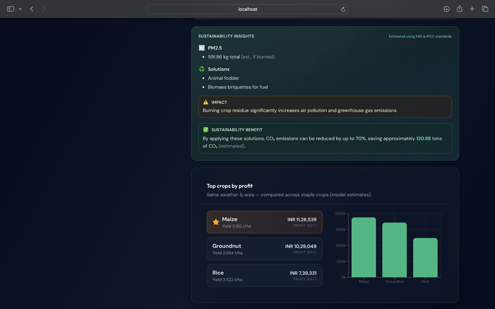
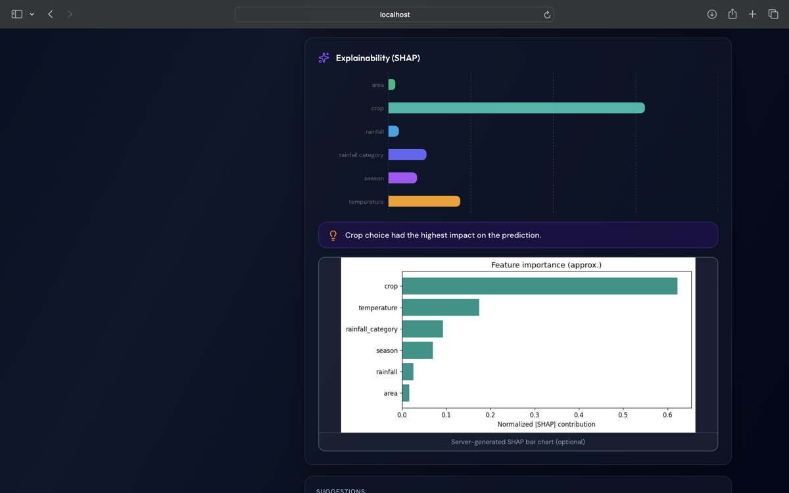
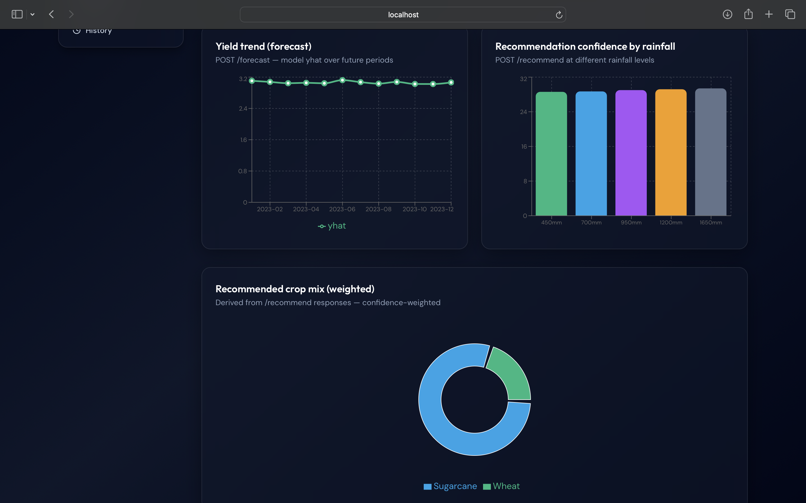
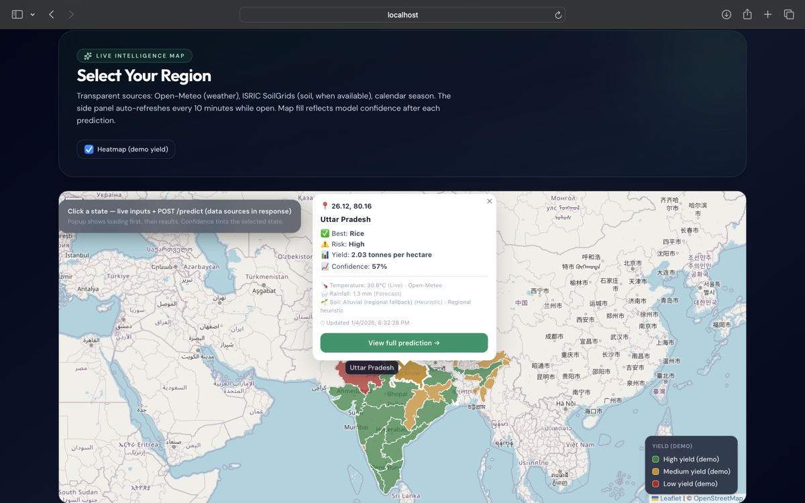
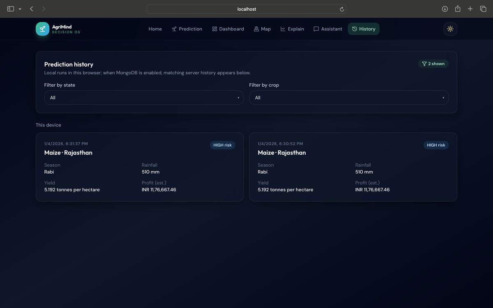
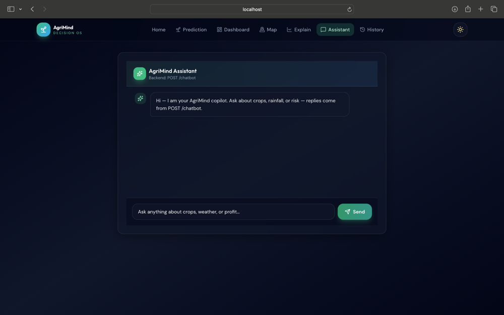

# 🌾 KrishiAI:An Intelligent Crop Yield Prediction and Recommendation System

AgriMind is a **full-stack intelligent decision support system** designed to help users make **data-driven agricultural and environmental decisions** using Machine Learning, real-time APIs, and interactive visualizations.

This project combines **ML models, Flask backend, and a modern React frontend** to provide **predictions, insights, and smart recommendations**.

---

## 📖 Project Overview

Agriculture and environmental systems generate large amounts of data (weather, soil, crop conditions), but this data is often underutilized.

AgriMind solves this by:

* Processing raw data
* Applying machine learning models
* Generating predictions
* Providing intelligent recommendations

👉 Goal: **Assist users in making smarter, data-driven decisions**

---

## ❓ Problem Statement

* Farmers and planners lack access to **real-time insights**
* Raw data is difficult to interpret
* No unified platform for:

  * Prediction
  * Visualization
  * Decision support

---

## 🎯 Objective

* Predict trends (e.g., crop suitability, environmental conditions)
* Provide smart recommendations
* Visualize insights clearly
* Integrate multiple data sources

---

## ⚙️ Key Features

* 🤖 Machine Learning-based prediction system
* 📊 Interactive dashboards & charts
* 🗺️ India map visualization (state-level insights)
* 🧠 Explainability module (model insights)
* 💬 Chatbot interface for interaction
* 🎤 Voice input support
* 🌓 Light/Dark mode UI
* 📈 Forecasting and risk analysis

---

## 📸 Application Screenshots

### 🏠 Home Interface

<p align="center">
  
  
</p>

---

### 🔮 Prediction Results

<p align="center">
  
  
  
</p>

---

### 📊 Dashboard & Analytics

<p align="center">
  
</p>

---

### 🗺️ Map Visualization

<p align="center">
  
</p>

---

### 🗄️ Data Storage / Backend

<p align="center">
  
</p>

---

### 💬 Chatbot Interface

<p align="center">
  
</p>


## 🏗️ Tech Stack

### 🔹 Frontend

* React (Vite)
* Tailwind CSS
* Framer Motion
* Recharts
* Leaflet (Maps)

### 🔹 Backend

* Flask (Python)
* REST APIs

### 🔹 Machine Learning

* Python
* Pandas, NumPy
* Scikit-learn

---

## 🔄 How the System Works

1. User inputs data (manual / voice / API)
2. Backend processes and cleans data
3. ML model generates predictions
4. APIs return results
5. Frontend displays insights visually

---

## 🚀 What Can Be Done Using This Project

* 🌱 Crop recommendation systems
* 🌦️ Weather-based decision support
* 📊 Data analytics dashboards
* 🧠 AI-based advisory systems
* 🌍 Smart agriculture solutions

---

## 🧠 Why This Project is Important

* Converts **data → actionable insights**
* Helps in **real-time decision making**
* Demonstrates **full-stack + ML integration**
* Scalable for real-world applications

---

## 📂 Project Structure

```bash
MLproject/
├── frontend/        # React frontend
├── backend/         # Flask backend
├── src/utils/       # Utility modules
├── models/          # ML logic
├── README.md
```

---

## ⚙️ Installation

```bash
cd MLproject
npm install
cp .env.example .env
```

---

## ▶️ Development

```bash
npm run dev
```

---

## 🧪 Backend

Run Flask backend:

```bash
cd backend
python app.py
```

---

## 🔗 API Endpoints

* `/predict` → Prediction
* `/forecast` → Future trends
* `/recommend` → Suggestions
* `/risk` → Risk analysis
* `/chatbot` → Chat interface
* `/explain` → Model explainability

---

## 📊 Tech Stack (Frontend Focus)

* Axios
* React + Vite
* Tailwind CSS
* Framer Motion
* Recharts
* React Router
* Leaflet

---

## 👩‍💻 Author

**Pranjali Yeotikar**

* 🎓 B.Tech (CSE - Core Branch)
* 🔗 GitHub: https://github.com/pranjali999
* 🔗 LinkedIn: https://www.linkedin.com/in/pranjali-yeotikar-042ab82a6

---

## ⭐ Key Highlights

* Full-stack ML project
* Real-time data handling
* API integration
* Interactive UI
* Scalable architecture

---

## 🚀 Future Enhancements

* Real-time IoT integration
* Deep learning models
* Mobile app
* Smart notifications

---

## 📜 License

MIT License
